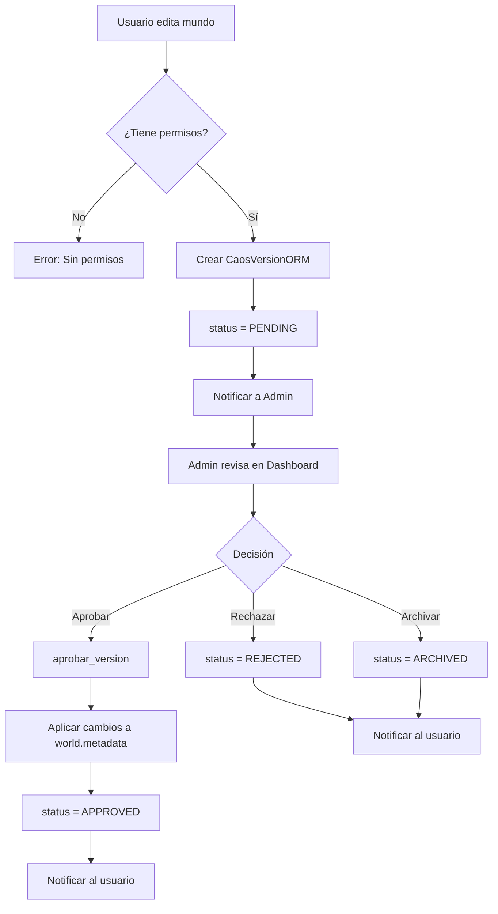

# 🏛️ ARCHITECTURE OVERVIEW

> **Propósito:** Mapa mental del proyecto para que cualquier IA pueda orientarse rápidamente.
> **Audiencia:** IAs colaboradoras, desarrolladores nuevos, tú mismo en 6 meses.

---

## 🎯 ¿Qué es este proyecto?

**FantasyWorld - Sistema de Gestión de Mundos de Fantasía**

Plataforma colaborativa para crear y gestionar universos de fantasía jerárquicos con:
- Sistema de propuestas y revisión
- Gestión de imágenes y portadas
- Narrativas con líneas temporales
- Sistema social (likes, comentarios)
- Roles y permisos

**Stack Técnico:**
- **Backend:** Django 4.x + PostgreSQL
- **Frontend:** Django Templates + Alpine.js + Tailwind CSS
- **Arquitectura:** Hexagonal (Domain-Driven Design)
- **IA:** Integración con Qwen (lore) y Stable Diffusion (imágenes)

---

## 📁 Estructura del Proyecto

```
FantasyWorld_ScreamingArch/
├── src/
│   ├── WorldManagement/Caos/          # 🎯 DOMINIO (Lógica de negocio)
│   │   ├── Domain/                    # Entidades, Value Objects
│   │   ├── Application/               # Use Cases
│   │   └── Infrastructure/            # Implementaciones (Repository)
│   │
│   ├── Infrastructure/DjangoFramework/ # 🔧 INFRAESTRUCTURA
│   │   ├── config/                    # Settings, URLs raíz
│   │   └── persistence/               # 📦 APP PRINCIPAL
│   │       ├── models.py              # Modelos ORM (CaosWorldORM, etc.)
│   │       ├── views/                 # Vistas organizadas por dominio
│   │       │   ├── world/             # 🆕 Vistas de mundos (modularizado)
│   │       │   │   ├── __init__.py    # Exports públicos
│   │       │   │   ├── listing.py     # Vista de inicio/índice
│   │       │   │   ├── detail.py      # Vistas de detalle (ver_mundo, etc)
│   │       │   │   ├── edit.py        # Vistas de edición
│   │       │   │   ├── actions.py     # Acciones (toggle, borrar, etc)
│   │       │   │   ├── versions.py    # Gestión de versiones
│   │       │   │   ├── utils.py       # Utilidades internas
│   │       │   │   └── legacy.py      # Funciones deprecadas
│   │       │   ├── world_views.py     # Wrapper de compatibilidad
│   │       │   ├── review_views.py    # Sistema de propuestas
│   │       │   ├── media_views.py     # Gestión de imágenes
│   │       │   └── dashboard/         # Panel de administración
│   │       │       ├── team/          # 🆕 Vistas de equipo (modularizado)
│   │       │       │   ├── __init__.py       # Exports públicos
│   │       │       │   ├── management.py     # Gestión de usuarios
│   │       │       │   ├── permissions.py    # Gestión de permisos/roles
│   │       │       │   ├── collaboration.py  # Equipos y colaboradores
│   │       │       │   ├── detail.py         # Detalle de usuario
│   │       │       │   └── ranking.py        # Ranking de usuarios
│   │       │       ├── team.py        # Wrapper de compatibilidad
│   │       │       ├── assets.py      # Gestión de assets
│   │       │       └── utils.py       # Utilidades del dashboard
│   │       ├── templates/             # Templates HTML
│   │       ├── static/                # CSS, JS, imágenes
│   │       ├── utils.py               # Funciones auxiliares
│   │       └── permissions.py         # Lógica de permisos
│   │
│   └── Shared/                        # Servicios compartidos
│       └── Services/SocialService.py  # Likes, comentarios
│
├── REFACTORING_BACKLOG.md            # 📋 Lista de refactorizaciones
├── TESTING_GUIDE.md                  # 🧪 Guía de testing
└── ARCHITECTURE.md                   # 📖 Este archivo
```

---

## 🗺️ Jerarquía de Mundos

```
CAOS (Nivel 0)
└── ABISMOS (Nivel 1)
    └── REALIDADES (Nivel 2)
        └── GALAXIAS (Nivel 3)
            └── ... (hasta 10 niveles)
```

**Modelo:** `CaosWorldORM`
- Cada mundo tiene `parent_id` (auto-referencia)
- `jid` = ID jerárquico (ej: "010203" = Caos 01 > Abismo 02 > Realidad 03)
- `public_id` = ID público amigable (ej: "XVCqUPzDXy")

---

## 🔄 Flujo de Propuestas (Sistema ECLAI)

### Visión General

El sistema de propuestas garantiza la integridad de datos mediante un flujo de revisión antes de aplicar cambios.



### 1. Creación de Propuesta

**Flujo:**
```
Usuario → editar_mundo() → Validar permisos → CaosVersionORM (status=PENDING)
```

**Modelos de Propuestas:**
- `CaosVersionORM`: Propuestas de mundos/períodos
  - `proposed_name`: Nuevo nombre (opcional)
  - `proposed_description`: Nueva descripción (opcional)
  - `cambios`: JSON con cambios de metadata
  - `status`: PENDING | APPROVED | REJECTED | ARCHIVED
  - `created_by`: Usuario que propone
  - `world`: Mundo afectado

- `CaosNarrativeVersionORM`: Propuestas de narrativas
- `CaosImageProposalORM`: Propuestas de imágenes
  - `action`: UPLOAD | SET_COVER | DELETE

**Ejemplo de `cambios` JSON:**
```json
{
  "cover_image": "NewCover.webp",
  "metadata": {
    "population": "1000000",
    "climate": "Tropical"
  }
}
```

### 2. Revisión

**Vista:** `review_views.py::review_proposal()`

**Flujo:**
```
Admin → /revisar/{TYPE}/{ID}/ → Mostrar diff → Aprobar/Rechazar/Archivar
```

**Funcionalidades:**
- **Diff visual:** Muestra cambios lado a lado (live vs propuesto)
- **Preview:** Permite ver cómo quedará antes de aprobar
- **Metadata diff:** Resalta cambios en metadata estructurados
- **Imágenes:** Preview de nuevas imágenes o cambios de portada

**Tipos de propuestas:**
- `WORLD`: Cambios en mundos
- `NARRATIVE`: Cambios en narrativas
- `IMAGE`: Cambios en imágenes
- `PERIOD`: Cambios en períodos temporales

### 3. Aprobación

**Función:** `review_views.py::aprobar_version()`

**Flujo:**
```
aprobar_version() → Validar permisos → Aplicar cambios → Actualizar status → Notificar
```

**Lógica de aplicación:**
```python
# 1. Copiar nombre si cambió
if version.proposed_name:
    world.name = version.proposed_name

# 2. Copiar descripción si cambió
if version.proposed_description:
    world.description = version.proposed_description

# 3. Aplicar cambios de metadata
if version.cambios:
    if 'metadata' in version.cambios:
        world.metadata.update(version.cambios['metadata'])
    
    if 'cover_image' in version.cambios:
        world.metadata['cover_image'] = version.cambios['cover_image']

# 4. Guardar
world.save()

# 5. Actualizar status de propuesta
version.status = 'APPROVED'
version.save()
```

### 4. Estados de Propuestas

| Estado | Descripción | Puede editar | Visible en |
|--------|-------------|--------------|------------|
| `PENDING` | Esperando revisión | Autor (modo retoque) | Dashboard |
| `APPROVED` | Aprobada y aplicada | No | Historial |
| `REJECTED` | Rechazada | Autor (modo retoque) | Historial |
| `ARCHIVED` | Archivada (no aplicar) | No | Historial |

### 5. Modo Retoque

**Propósito:** Permitir corregir propuestas rechazadas sin crear una nueva.

**Flujo:**
```
Propuesta REJECTED → Usuario edita → Modo retoque activado → 
Pre-rellena formulario → Usuario corrige → Envía → status = PENDING
```

**Implementación:**
```python
# En editar_mundo()
if request.GET.get('retouch_version'):
    version_id = request.GET['retouch_version']
    version = CaosVersionORM.objects.get(id=version_id)
    
    # Pre-rellenar formulario con datos de la propuesta
    initial_data = {
        'name': version.proposed_name or world.name,
        'description': version.proposed_description or world.description,
        # ... metadata ...
    }
```

### 6. Notificaciones

**Sistema:** `Message` model + API de mensajes

**Eventos que generan notificaciones:**
- Propuesta creada → Notificar a admins
- Propuesta aprobada → Notificar al autor
- Propuesta rechazada → Notificar al autor (con razón)
- Propuesta archivada → Notificar al autor

**Ejemplo:**
```python
Message.objects.create(
    recipient=version.created_by,
    sender=request.user,
    subject=f"Propuesta aprobada: {world.name}",
    body=f"Tu propuesta para {world.name} ha sido aprobada.",
    related_object_type='VERSION',
    related_object_id=version.id
)
```

---

## 🖼️ Sistema de Imágenes

### Estructura de Archivos
```
static/persistence/img/
├── 01/                    # Mundo con ID numérico
│   └── imagen.webp
├── 01_Caos_Prime/         # Carpeta legacy (ID_Nombre)
│   └── imagen.webp
└── placeholder.png        # Imagen genérica
```

### Resolución de Portadas (CRÍTICO)

**Función central:** `get_world_images(jid)` en `utils.py`

**Lógica:**
1. Busca carpeta por ID numérico (`01/`)
2. Si no existe, busca carpeta legacy (`01_Nombre/`)
3. Lee metadata de cada imagen (`.date`, `.author`)
4. Identifica portada con `world.metadata['cover_image']`
5. Matching **case-insensitive** y sin extensión

**Usado en:**
- `world_views.py` (vista de mundo)
- `review_views.py` (revisión de propuestas)
- `team.py` (ranking de usuarios)

---

## 🔐 Sistema de Permisos

**Archivo:** `permissions.py`

### Roles
```python
EXPLORER  # Usuario normal
SUBADMIN  # Moderador
ADMIN     # Administrador
```

### Funciones Clave
```python
check_ownership(user, world)
# Verifica: ¿Es dueño O miembro del equipo?

check_team_access(user, world)
# Verifica: ¿Está en el equipo del dueño?
```

### Lógica de Edición
```
Puede editar SI:
- Es el autor (world.author == user)
- Es miembro del equipo del autor
- Es Admin/Superuser
- El mundo NO está bloqueado (is_locked=False)
```

---

## 📊 Sistema Social

**Servicio:** `SocialService` en `src/Shared/Services/`

### Modelos
- `CaosLike`: Likes en mundos/narrativas/imágenes
- `CaosComment`: Comentarios con rating (1-5 estrellas)

### Keys de Interacción
```python
f"WORLD_{public_id}"      # Likes en mundo
f"narr_{public_id}"       # Likes en narrativa
f"IMG_{filename}"         # Likes en imagen
```

---

## 🎨 Frontend

### Tecnologías
- **Templates:** Django Templates (Jinja-like)
- **Interactividad:** Alpine.js (x-data, x-show, etc.)
- **Estilos:** Tailwind CSS
- **Componentes:** Partials reutilizables

### Componentes Clave
```
templates/
├── layouts/base.html           # Layout base
├── components/
│   ├── _period_selector.html   # Selector de períodos
│   └── _metadata_manager.html  # Editor de metadata
└── staff/
    ├── review_proposal.html     # Vista de revisión
    └── partials/
        └── ranking_item.html    # Item de ranking
```

---

## 🚨 Puntos Críticos (No Tocar Sin Cuidado)

### 1. Resolución de Portadas
**Archivos:**
- `utils.py::get_world_images()`
- `world_views.py::comparar_version()` (líneas 676-697)
- `review_views.py::review_proposal()` (líneas 140-175)

**Por qué:** Lógica compleja, case-insensitive, carpetas legacy.

### 2. Sistema de Propuestas
**Archivos:**
- `review_views.py::aprobar_version()`
- `review_views.py::review_proposal()`

**Por qué:** Maneja metadata, permisos, notificaciones.

### 3. Permisos
**Archivo:** `permissions.py`

**Por qué:** Seguridad, no queremos que usuarios editen mundos ajenos.

---

## 🔧 Funciones Auxiliares Importantes

### `utils.py`
```python
# === Gestión de Imágenes ===
get_world_images(jid)           # Lista imágenes de un mundo
find_cover_image(cover_filename, all_imgs)  # 🆕 Encuentra portada (case-insensitive, sin extensión)
get_thumbnail_url(world_id, cover_filename, use_first_if_no_cover)  # 🆕 URL de thumbnail con fallback

# === Otras Utilidades ===
resolve_jid_orm(jid)            # Convierte JID → CaosWorldORM
get_user_avatar(user, jid)      # Avatar de usuario
get_metadata_diff(live, proposed) # Diff de metadata
```

**🆕 Funciones Nuevas (2026-01-03):**

#### `find_cover_image(cover_filename, all_imgs)`
Centraliza la lógica de búsqueda de portadas que antes estaba duplicada en 4 archivos.

**Estrategia:**
1. Coincidencia exacta (case-insensitive)
2. Coincidencia sin extensión (para casos donde metadata tiene "Image" pero archivo es "Image.webp")

**Usado en:**
- `utils.py::get_world_images()` - Marca `is_cover=True`
- `world_views.py::comparar_version()` - Vista de comparación
- `review_views.py::review_proposal()` - Vista de revisión
- Indirectamente en `team.py` vía `get_thumbnail_url()`

#### `get_thumbnail_url(world_id, cover_filename=None, use_first_if_no_cover=True)`
Simplifica obtención de thumbnails con fallback inteligente.

**Prioridad de fallback:**
1. Cover image definida (si `cover_filename` proporcionado)
2. Primera imagen disponible (si `use_first_if_no_cover=True`)
3. Placeholder genérico (`/static/img/placeholder.png`)

**Usado en:**
- `team.py::UserRankingView` - Thumbnails de mundos y narrativas


### `view_utils.py`
```python
generate_breadcrumbs(jid)       # Breadcrumbs jerárquicos
get_children_label(jid)         # Label de hijos ("Abismos", etc.)
```

---

## 📝 Convenciones de Código

### Nombres
- **Modelos ORM:** Sufijo `ORM` (ej: `CaosWorldORM`)
- **Use Cases:** Sufijo `UseCase` (ej: `GetWorldDetailsUseCase`)
- **Vistas:** Verbos descriptivos (ej: `editar_mundo`, `aprobar_version`)

### IDs
- `jid`: ID jerárquico interno ("010203")
- `public_id`: ID público amigable ("XVCqUPzDXy")
- `id`: Primary key de Django

### Status
```python
PENDING   # Pendiente de revisión
APPROVED  # Aprobado
REJECTED  # Rechazado
ARCHIVED  # Archivado
```

---

## 🐛 Debugging

### Logs Temporales
- `debug_log.txt` (gitignored) - Logs de debugging

### Comandos Útiles
```bash
# Ver logs del servidor
python server_run.py

# Shell de Django
python manage.py shell

# Migraciones
python manage.py makemigrations
python manage.py migrate
```

---

## 🚀 Próximos Pasos Sugeridos

1. **Refactorizar resolución de portadas** (ver `REFACTORING_BACKLOG.md`)
2. **Añadir tests de permisos** (ver `TESTING_GUIDE.md`)
3. **Dividir `world_views.py`** (882 líneas → módulos)
4. **Documentar flujo de narrativas** (falta en este doc)

---

## 📞 Para IAs Colaboradoras

**Antes de hacer cambios grandes:**
1. Lee este archivo completo
2. Revisa `REFACTORING_BACKLOG.md`
3. Pregunta al usuario si hay prioridades

**Al añadir features:**
1. Sigue las convenciones de nombres
2. Actualiza este documento si cambias arquitectura
3. Añade a `REFACTORING_BACKLOG.md` si duplicas código

**Al refactorizar:**
1. Marca items completados en `REFACTORING_BACKLOG.md`
2. Actualiza este documento si cambias flujos

---

**Última actualización:** 2026-01-03
**Versión:** 0.1 (ECLAI)
**Mantenido por:** IAs colaboradoras del proyecto
